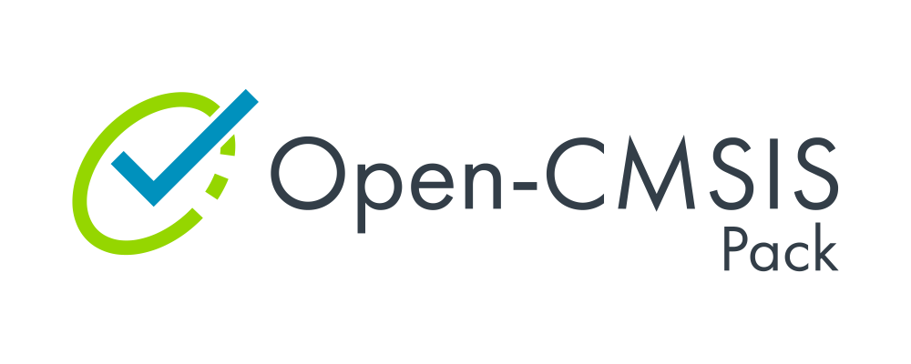

# Simplifying IoT Workflows and Lifecycle Management

## Overview

The Open-CMSIS-Pack project provides tools, methods, and infrastructure to integrate and manage software components and
improve code reuse across embedded and IoT projects. The project is currently hosted and managed as an incubation
project by Linaro in partnership with Arm, NXP and STMicroelectronics.

Software compatibility for component re-use has long been a challenge in the microcontroller space, especially for the
IoT, which is much more diverse at the hardware level compared to PCs or the data center. Open-CMSIS-Pack removes this
complexity, delivering a standard for software component packaging and related foundation tools for validation,
distribution, integration, management, and maintenance.

## What are CMSIS-Packs?

CMSIS-Pack is a packaging technology that supports more than
[11,000 microcontrollers](https://www.keil.arm.com/devices/). Packs provide a delivery mechanism for software
components, device parameters, and evaluation board support. A software pack (file collection) includes:

- Source code, header files, and software libraries
- Documentation and source code templates
- Device parameters along with startup code and programming algorithms
- Example projects

The CMSIS-Pack system solves several problems:

- It provides meta-data of files that relate to a software component. All files that belong to a software component can
  be identified and information about the original provider is preserved.
- It enables consistent software component upgrade and identifies incompatible configuration files that may be part of
  the user application.
- Software component providers can specify the interfaces and relationship to other software components.
- The meta-data of a software component can include dependency information for toolchains, devices, and processors
  which simplifies the integration into application programs.

Refer to the
[Open-CMSIS-Pack specification](https://open-cmsis-pack.github.io/Open-CMSIS-Pack-Spec/main/html/index.html) for more
information.

## What is the CMSIS-Toolbox?

The [CMSIS-Toolbox](https://github.com/Open-CMSIS-Pack/cmsis-toolbox) provides command-line tools for project creation
and build of embedded applications utilizing CMSIS-Packs. It supports multiple compilation tools. It also helps you
with software pack creation, maintenance, and distribution utilizing the CMSIS-Pack format.

## Get involved

If you want to get involved,
[join our Technical Project Meetings - Tuesdays 16:00 - 17:00 CET](https://linaro-org.zoom.us/j/92425995029?pwd=ds00bMVC1MuUX80rLzoNNj82SXs3Mn.1).

